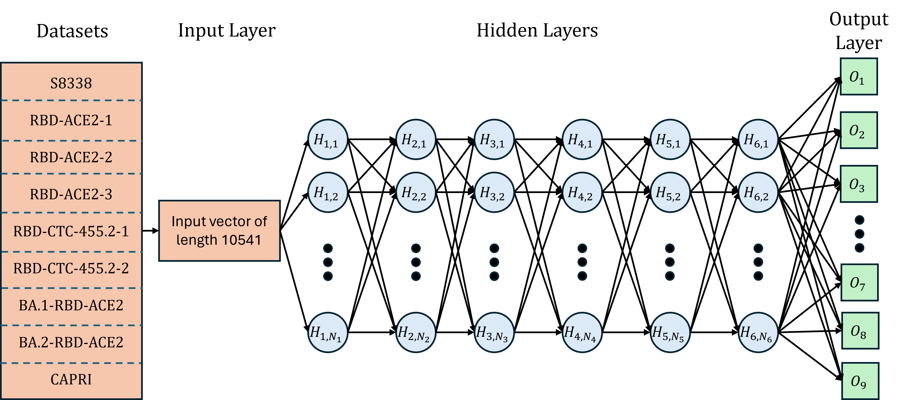

# MT-TopLap <!-- [](https://www.google.com/) --> [](https://opensource.org/licenses/MIT) 

## Model Architecture

The multitask deep learning architecture of MT-TopLap model is shown below.



Further explain the details in the [paper](https://github.com/ExpectozJJ/MT-TopLap), providing context and additional information about the architecture and its components.

---

## Getting Started

### Prerequisites

- fair-esm                  2.0.0
- numpy                     1.23.5
- scipy                     1.11.3
- torch                     2.1.1
- pytorch-cuda              11.7
- scikit-learn              1.3.2
- python                    3.10.12

### Installation

```
git clone https://github.com/ExpectozJJ/MT-TopLap
```

---

## Multi-task Pre-training Datasets

| Dataset                                                            | No. of samples | PDB ID                                                                       |
|--------------------------------------------------------------------|-------------------------------------|------------------------------------------------------------------------------|
| RBD-ACE2-1                                     | 3669                                | 6M0J                                                  |
| RBD-ACE2-2                                    | 1539                                | 6M0J                                                  |
| RBD-ACE2-3                            | 2223                                | 6M0J                                                  |
| RBD-CTC-455.2-1                             | 1539                                | 7KL9                                                    |
| RBD-CTC-455.2-2                            | 2831                                | 7KL9                                                    |
| BA.1-RBD-ACE2                            | 3800                                | 7T9L                                                   |
| BA.2-RBD-ACE2                                 | 3686                                | 7XB0                                                  |
| CAPRI  | 1862                                | 3R2X |

## 10-fold Cross-Validation Benchmarking 
| Dataset    | No. of Samples | No. of PPIs | PDB Source                      |
|------------|----------------|-------------|---------------------------------|
| Original   | 8338           | 319         | Download from RCSB              |
| AlphaFold3 | 8330           | 317         | Download from AlphaFold Server  |

---
## Preparing Topologial Sequence

```shell
# get the usage
python ./code_pkg/main_potein_ligand_topo_embedding.py -h

# examples
python ./code_pkg/main_potein_ligand_topo_embedding.py --output_feature_folder "../examples/output_topo_seq_feature_result" --protein_file "../examples/protein_ligand_complex/1a1e/1a1e_pocket.pdb" --ligand_file "../examples/protein_ligand_complex/1a1e/1a1e_ligand.mol2" --dis_start 0 --dis_cutoff 5 --consider_field 20
```


---

## Results


#### Pretrained models
- Pretrained TopoFormer model large. [Download](https://weilab.math.msu.edu/Downloads/TopoFormer/TopoFormer_s_pretrained_model.zip)

#### Finetuned models and performances
- Scoring

| Finetuned for scoring                                                | Training Set                  | Test Set| PCC | RMSE (kcal/mol) |
|-------------------------------------------------                     |-------------                  |---------|-    |-                |
| CASF-2007 [result](./Results)      | 1105                          | 195     |0.837|1.807|
| CASF-2007 small [result](./Results)| 1105                          | 195     |0.839|1.807|
| CASF-2013 [result](./Results)      | 2764                          | 195     |0.816|1.859|
| CASF-2016 [result](./Results)      | 3772                          | 285     |0.864|1.568|
| PDB v2016 [result](./Results)      | 3767                          | 290     |0.866|1.561|
| PDB v2020 [result](./Results)      | 18904 <br> (exclude core sets)|195<br>CASF-2007 core set|0.853|1.295|
|                                    |                               |195<br>CASF-2013 core set|0.832|1.301|
|                                    |                               |285<br>CASF-2016 core set|0.881|1.095|

Note, there are 20 TopoFormers are trained for each dataset with distinct random seeds to address initialization-related errors. And 20 gradient boosting regressor tree (GBRT) models are subsequently trained one these sequence-based features, which predictions can be found in the [results](./Results) folder. Then, 10 models were randomly selected from TopoFormer and GBDT models, respectively, the consensus predictions of these models was used as the final prediction result. The performance shown in the table is the average result of this process performed 400 times.

- Docking


| Finetuned for docking                                                | Success rate |
|-------------------------------------------------                     |-             |
| CASF-2007 [result](./Results)| 93.3%         |
| CASF-2013 [result](./Results)| 91.3%         |

- Screening

| Finetuned for screening                                              |Success rate on 1%|Success rate on 5%|Success rate on 10%|EF on 1%|EF on 5%|EF on 10%|
|-                                                                     | - | - | - | - | - | - |
| CASF-2013 |68%|81.5%|87.8%|29.6|9.7|5.6|

Note, the EF here means the enhancement factor. Each target protein has a finetuned model. [result](./Results) contains all predictions.

---

## License

This project is licensed under the MIT License - see the [LICENSE](LICENSE) file for details.

---

## Citation

If you use this code or the pre-trained models in your work, please cite our work. 
- JunJie Wee and Guo-Wei Wei. "Benchmarking AlphaFold3's protein-protein complex accuracy and machine learning prediction reliability for binding free energy changes upon mutation."
- JunJie Wee, Jiahui Chen and Guo-Wei Wei. "Preventing future zoonosis: SARS-CoV-2 mutations enhancing human-animal cross-transmission."
---
